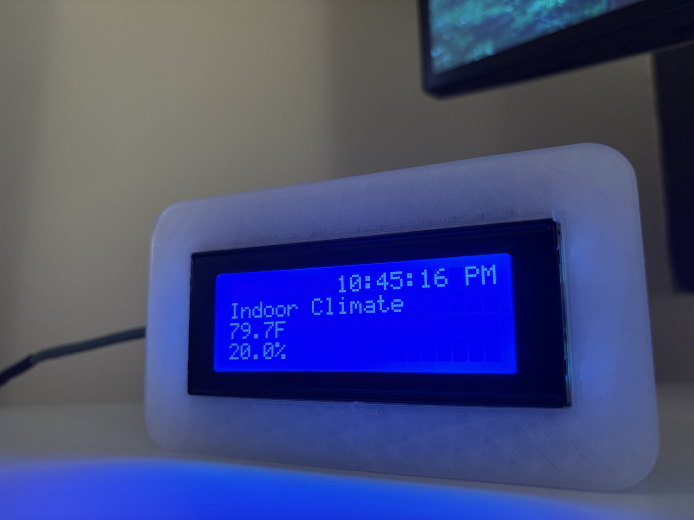
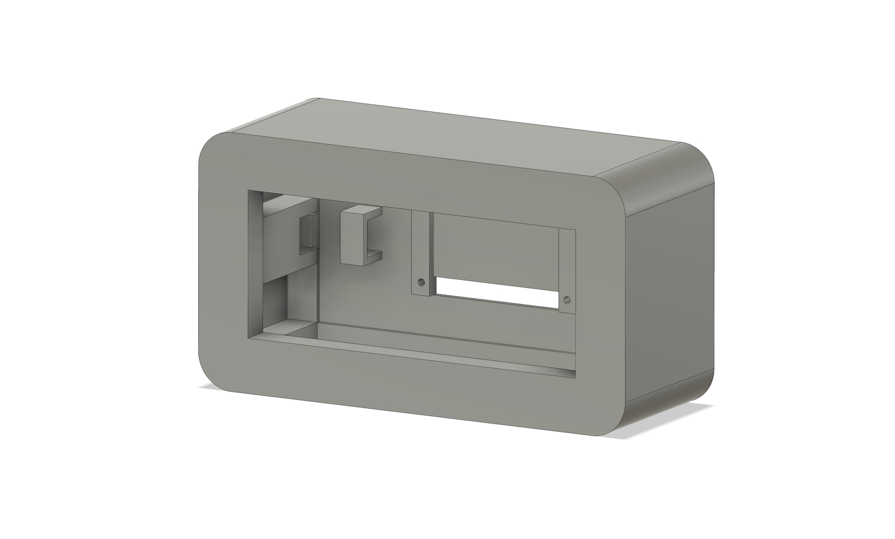

# ESP8266 LCD Dashboard

This project is a feature-rich 20x4 LCD dashboard powered by an ESP8266 microcontroller. It can display weather, news, indoor climate data, and much more.

<!-- 
 -->

  
  

## 🔧 Features

- Time from NIST
- Weather display using a OpenWeatherAPI
- Local news via RSS
- DHT11 temperature and humidity readings
- Remote control via infrared remote

## Hardware Setup

- LCD SDA pin -> ESP8266 D2 pin
- LCD SCL pin -> ESP8266 D1 pin
- IR Reciever data pin -> ESP8266 D5 pin
- DHT11 Sensor data pin -> ESP8266 D6 pin

## External Libraries

- LCD I2C
  - duinowitchery/hd44780@^1.3.2
- IR Reciever
  - crankyoldgit/IRremoteESP8266@^2.8.6
- DHT11
  - adafruit/Adafruit Unified Sensor @ ^1.1.15
  - adafruit/DHT sensor library @ ^1.4.6
- Weather and News parsing
  - bblanchon/ArduinoJson @ ^7.4.2

## TODO

- Add location and news url to secrets.h
- Local server to update messages remotely
- Pixel art / fun animations
- Custom character LCD handling
- AP wifi Setup
- EEPROM
- Pagination
- Wi-Fi signal monitoring
